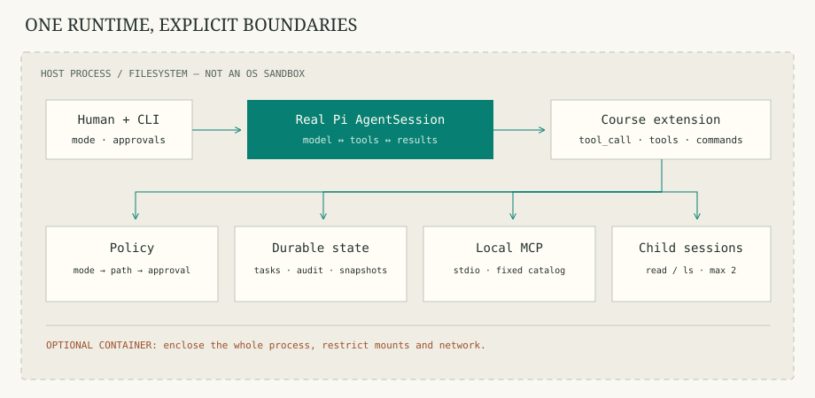

# learn-pi

**面向会一点 Python 的读者，用 TypeScript 扩展真实 Pi，逐章构建自己的编程 Agent。**

[English](README.en.md) · [快速开始](docs/guide/quickstart.md) · [课程路线](docs/guide/route.md) · [版本与来源](docs/reference/sources.md) · [验收报告](reports/ACCEPTANCE.md)

从 Pi 的模型与工具循环出发，逐步加入计划/执行、可恢复任务、审批与路径保护、真实本地 MCP、只读子 Agent、测试与 Git 检查点，最后用 SDK 装配成一个本地可运行的教学作品。主实现只有一套 TypeScript；Python 仅用于前导概念对照与进阶 RPC 参考。



## 十分钟开始

需要 Node **>=22.19.0**、npm 和 Git；建议 Node 24 LTS。在仓库根目录运行：

```sh
git clone https://github.com/original4422/learn-pi.git
cd learn-pi
# 使用 nvm 时，先运行 nvm install && nvm use（读取 .nvmrc 的 24.16.0）。
npm ci --ignore-scripts
npm run verify
npm run demo
npm run docs:dev
```

网站默认中文，顶部切换完整英文版本。开发预览通常在 `http://127.0.0.1:5173`，以终端输出为准，只监听本机。`npm run docs:build` 生成静态站，`npm run docs:preview` 预览产物。

`demo` **不需要 API Key**。它通过官方脚本化 Provider 驱动真实 Pi，实际读取、编辑、调用 MCP、运行测试和恢复检查点。它验证运行时与工具接线，**不代表真实模型推理已经验证**。

## 逐章运行

每章都使用同一个实现：

```sh
# 无 Key：真实 Pi + 该阶段的脚本化响应
npm run stage -- --stage 4

# 有模型凭据：交互式运行该阶段
npm run lab:reset
npm run agent -- --stage 4 --workspace examples/workspaces/todo
```

| 章节 | 能力与判断 | 源码入口 |
| --- | --- | --- |
| [00](docs/chapters/00-typescript.md) | Python 开发者需要的最少 TypeScript | `src/core/tasks.ts` |
| [01](docs/chapters/01-pi.md) | Pi 原生底座、工具循环与会话 | `src/runtime.ts` |
| [02](docs/chapters/02-plan.md) | 只读探索与人控制的模式切换 | `src/core/policy.ts` |
| [03](docs/chapters/03-tasks.md) | 任务清单、原子快照与恢复 | `src/core/tasks.ts` |
| [04](docs/chapters/04-policy.md) | 审批、规范化路径与审计 | `src/core/policy.ts` |
| [05](docs/chapters/05-mcp.md) | 固定本地 MCP 服务 | `src/integrations/mcp.ts` |
| [06](docs/chapters/06-subagents.md) | 两种只读角色、并发与失败收敛 | `src/integrations/subagents.ts` |
| [07](docs/chapters/07-coding.md) | 修改、测试、diff 与样例检查点 | `src/core/checkpoints.ts` |
| [08](docs/chapters/08-context.md) | 上下文管理、资源加载与容器边界 | `src/runtime.ts` |
| [09](docs/chapters/09-sdk.md) | SDK 装配与完整编程任务 | `src/cli.ts` |

## 使用真实模型

课程使用 Provider 环境变量和仓库内 `.cache/pi-agent/` 认证，不自动读取全局 Pi 登录。用锁定版本登录：

```sh
PI_CODING_AGENT_DIR="$PWD/.cache/pi-agent" npm exec pi --
# 在 Pi 中执行 /login，完成后退出。
npm run lab:reset
npm run agent -- --stage 9 --workspace examples/workspaces/todo
```

也可以安全地配置对应 API Key 环境变量，再用 `--provider` / `--model` 选择实际可用模型。默认 `plan` 模式；先读代码与测试，审阅计划后由人输入 `/mode execute`，再逐项批准具体操作。`/tasks`、`/status`、`/checkpoint LABEL`、`/restore ID`、`/compact` 和 `/quit` 提供宿主控制。

退出后，用 `npm run agent -- --workspace examples/workspaces/todo --resume` 继续当前工作区最近活跃的会话。对话保存在工作区 `.learn-pi/sessions/`，启动时显示会话 ID 与文件。省略 `--resume` 会新建对话；续聊使用本次启动的阶段、模型和模式，默认仍为 `plan`。

`npm run model:smoke` 在有匹配凭据时执行真实模型样例，否则明确记录 `SKIPPED`，结果在 `reports/model-smoke.json`。验收机器没有可用模型凭据，远程模型效果未验证。

运行 `npm run recovery:demo`，观察真实 Pi 进程崩溃与重启：动作已完成、工具结果尚未写入会话，宿主核对虚构收据后继续任务，动作不会被重放。使用官方脚本模型，无需 Key。详见[故障恢复实验](docs/chapters/03-tasks.md#进程在动作完成后崩溃-先核对-再恢复)。

## 清楚的边界

- **Pi 原生能力**：模型接入、循环、内置工具、事件、会话、压缩、Skills 等。课程复用它们。
- **官方示例启发**：计划、任务、审批、子 Agent、检查点等。来源和 MIT 说明见 [THIRD_PARTY_NOTICES.md](THIRD_PARTY_NOTICES.md)。
- **课程新增组合**：统一策略、工作区任务恢复、固定 MCP、有限只读分派、可丢弃检查点和双语实验。
- 审批钩子与路径过滤**不是 OS 沙箱**。批准的 shell/测试代码持有宿主权限；`--approve-fixture` 也会执行模型修改后的代码和继承环境。更强隔离见 [容器配置](containers/README.md)，本机因无运行中 Docker daemon 未执行容器探针。
- 子 Agent 有独立对话与工具边界，仍共享 Node 进程和文件系统。会话分支、任务恢复与文件回滚是三种不同操作。

Pi 固定 `0.85.1`，npm 对应源码 `d981de1229ef899957bbe968bc8dcda02a21f477`，使用 `@earendil-works/*` 主包名。完整锁定证据见 [version-lock.json](reports/version-lock.json)。

## 开发与验收

```sh
npm run check
npm test
npm run test:integration
npm run docs:build
npm run docs:check
```

[实验说明](docs/guide/labs.md)区分确定性测试、真实 Pi/MCP 集成、模型实测与容器实测。[架构地图](docs/guide/architecture.md)定位源码，[贡献说明](CONTRIBUTING.md)说明双语与测试要求。

MIT · [许可证](LICENSE)
